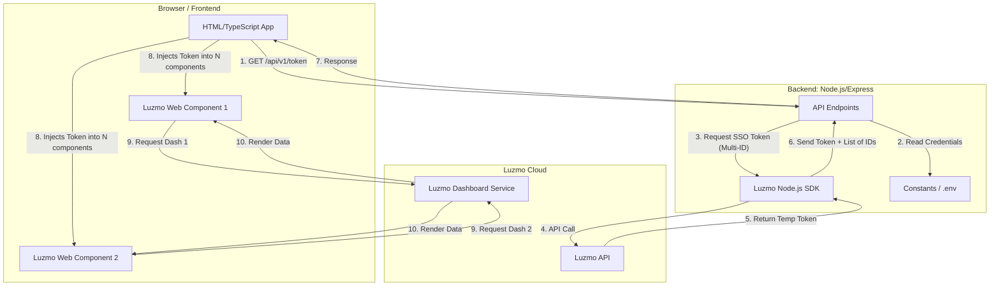
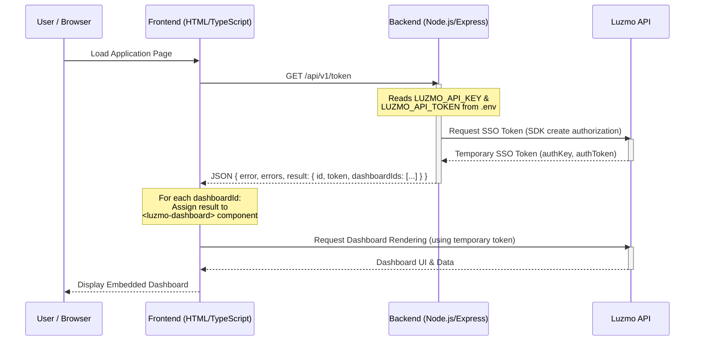

# Architecture Document: Luzmo Embedded Dashboard PoC

## 1. Overview
This document outlines the architecture for the Luzmo Embedded Dashboard Proof of Concept (PoC). The goal is to embed a Luzmo dashboard securely within a custom application while minimizing complexity and adhering to a strict 1-hour timebox.

## 2. System Architecture
The solution employs a lightweight two-tier architecture:
- **Frontend (Client-side):** An HTML/TypeScript application responsible for rendering the UI and embedding the Luzmo dashboard.
- **Backend (Server-side):** A Node.js/Express application acting as a secure intermediary to handle authentication with the Luzmo API.

### Architecture Overview Diagram

> [!NOTE]
> All API endpoints (e.g., `/api/v1/token`) are centralized in the backend `constants.ts` (pointing to [Constants.md](./Constants.md)).

## 3. Component Details

### 3.1 Frontend (HTML/TypeScript)
Detailed specifications, technology choices, and frontend responsibilities are maintained in the **[Frontend.md](./Tech_Stack/Frontend.md)** document.

### 3.2 Backend (Node.js / Express)
Detailed specifications, security standards, and backend responsibilities are maintained in the **[Backend.md](./Tech_Stack/Backend.md)** document.

## 4. Data Flow & Security

### 4.1 Token Generation Flow
1. **Client Request:** The frontend application makes a `GET` request to the backend's `/api/v1/token` endpoint on load (pointing to [Constants.md](./Constants.md)).
2. **Backend Authentication:** The Node.js backend uses its securely stored `LUZMO_API_KEY` and `LUZMO_API_TOKEN` to request an SSO token from the Luzmo API via the SDK. The request includes all dashboard IDs configured in the environment.
3. **Token Response:** Luzmo returns a temporary authorization token (with a defined `inactivity_interval`).
4. **Token Delivery:** The backend forwards this temporary token and the list of `dashboardIds` to the frontend.
5. **Dashboard Rendering:** The frontend iterates through the `dashboardIds`, creating a `<luzmo-embed-dashboard>` web component for each and injecting the same temporary token. Each component then securely requests and renders its respective dashboard data directly from Luzmo's servers.

### Token Generation Sequence Diagram

> [!NOTE]
> The `ROUTE_AUTH_TOKEN` constant refers to the `/api/v1/token` endpoint (pointing to [Constants.md](./Constants.md)).

### 4.2 Security Considerations
- **Zero Client-Side Secrets:** Luzmo API keys and tokens are strictly kept on the server. They are never exposed to the client browser.
- **Temporary Access:** The SSO tokens generated are temporary and will expire after a period of inactivity, mitigating the risk of stolen tokens.
- **Future Expansion (Row-Level Security):** Although not implemented in this baseline PoC, the architecture fully supports multi-tenancy and data filtering. The backend can be extended to pass user-specific parameters (e.g., Tenant ID) to Luzmo during token generation, ensuring users only see their authorized data.

## 5. Deployment & Scalability
- **Current State:** Designed to run locally on `localhost:3500` (see [Constants.md](./Constants.md)) for rapid development and demonstration.
- **Future State:** This architecture is container-ready and easily deployable to lightweight hosting services such as Google Cloud Run, Heroku, or Render. The stateless nature of the Express backend ensures it can scale horizontally without issues.
without issues.
